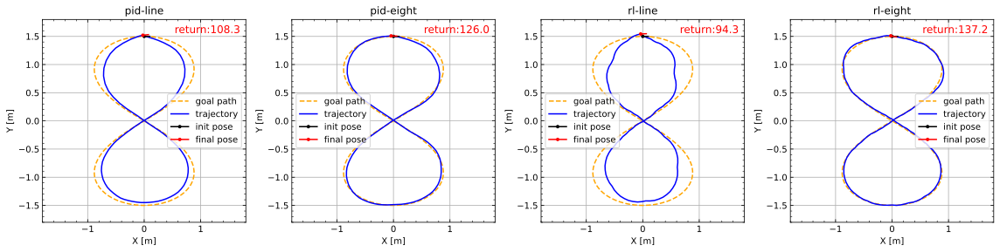

# surrogate-fish

This repertory is a **REPRODUCTION** of paper [From Simulation to Reality: A Learning Framework for Fish-Like Robots to Perform Control Tasks](https://ieeexplore.ieee.org/document/9802680/) published in T-RO 2022. 

This repertory have implemented:

1. Surrogate model of robotic fish for reinforcement learning or control parameters tuning.
2. REINFORCE (with baseline) algorithm for various tasks training.
3. Comparison between classical controller (PID), trivial imitation learning controller and RL controller (REINFORCE with baseline).

The fact that the vast majority of works in the field of robotic fish does not release its source code. I hope that this repertory can help researchers of robotic fish control algorithms easily reproduce the state-of-the-art methods to compare with their own method.

## Attention

The following are noteworthy points that I have discovered during the process of reproducing:

1. The author stated in the article that they were using the Advantage Actor-Critic (A2C) algorithm, but indeed, they were using the REINFORCE (with baseline) algorithm because they also claimed in the article that they were using a set of collected trajectories to calculate the state value, rather than using the TD algorithm.

2. During the trajectory tracking task training process, the tracking performance of the policy network trained solely on straight lines cannot achieve the results described in the article under the '8' trajectory.

3. The author claims in the article that using Curriculum Learning (CL) can gradually master the Hard-Level Pose Regulation task with 100% successful rate, but indeed, it dose not work. In addition to the hyper-parameters recommanded in the article, I have also tried many different hyper-parameters, but none of them worked.

## Getting Started

PS: In addition, while ensuring the readability of the code, I have provided concise enough code so that you can roughly infer the purpose of each part by its name. If you have any questions, you can raise an ISSUE and I am happy to help you fix it and reproduce this work.

## Experimental Results

### Path Following

short line

eight curve

PS: The title ('method'-'env') of each subfigure represent the method and the environment in which parameters are tuned or trained.

### Pose Regulation

easy-level (delta_p = 1.4, delta_phi = -0.99, eta = 0.01)

middle-level (delta_p = 1.5, delta_phi = -1.57, eta = -0.15)

hard-level (delta_p = 1.8, delta_phi = 1.57, eta = 2.55)

PS: The 'il-pid' represent the Imitation Learning (IL) policy based on 'pid' controller. The 'rl-hard' represent the policy after learning in the hard-level env.

## References

1. [From Simulation to Reality: A Learning Framework for Fish-Like Robots to Perform Control Tasks](https://ieeexplore.ieee.org/document/9802680/)
2. [Path-following Control of Fish-like Robots: A Deep Reinforcement Learning Approach](https://linkinghub.elsevier.com/retrieve/pii/S2405896320329724)
3. [CFD based parameter tuning for motion control of robotic fish](https://iopscience.iop.org/article/10.1088/1748-3190/ab6b6c)
4. [Bottom-level motion control for robotic fish to swim in groups: modeling and experiments](https://iopscience.iop.org/article/10.1088/1748-3190/ab1052)
5. [Design and Implementation of a High Precision Posture Control Algorithm for Robotic Fish](https://robot.sia.cn/cn/article/doi/10.13973/j.cnki.robot.2016.0241)
6. [Exploring Learning-Based Control Policy for Fish-Like Robots in Altered Background Flows](https://ieeexplore.ieee.org/document/10342394)
